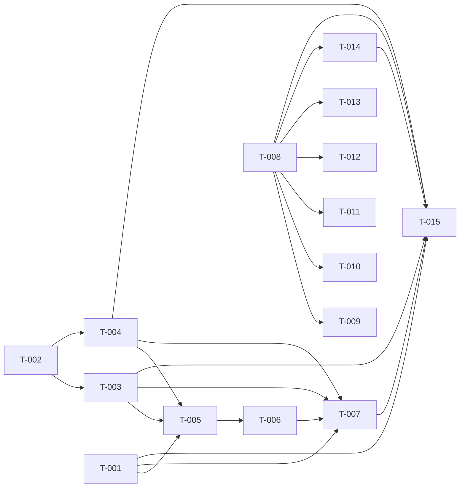

# Build Site: Dedup / Modularization Campaign

15 tasks across 5 tiers from 2 kits (cavekit-dedup-components.md, cavekit-dedup-routes.md).

Goal: extract 4 shared rendering components + a TagBadge audit, then unify 21 triplicated route files (7 patterns × 3 systems) into 7 registry-driven dynamic routes. `npm run build` must pass after every task (SPEC V34); no URLs may change.

SPEC invariants in scope: V48, V49, V50, V51, V52, V53.

---

## Tier 0 — No Dependencies (Start Here)

| Task | Title | Cavekit | Requirement | Effort |
|------|-------|---------|-------------|--------|
| T-001 | Create ClassProgressionTable.astro | cavekit-dedup-components.md | R1 | L |
| T-002 | Audit + extract shared TagBadge component | cavekit-dedup-components.md | R5 | M |
| T-008 | Create resolveSystem() registry utility | cavekit-dedup-routes.md | R1 | S |

---

## Tier 1 — Depends on Tier 0

| Task | Title | Cavekit | Requirement | blockedBy | Effort |
|------|-------|---------|-------------|-----------|--------|
| T-003 | Create TraitCatalogSection.astro | cavekit-dedup-components.md | R2 | T-002 | M |
| T-004 | Create ClassFeatureBlock.astro | cavekit-dedup-components.md | R3 | T-002 | M |
| T-009 | Unify [system]/index.astro route | cavekit-dedup-routes.md | R2 | T-008 | M |
| T-010 | Unify [system]/[sphere]/index.astro route | cavekit-dedup-routes.md | R3 | T-008 | M |
| T-011 | Unify [system]/[sphere]/[talent].astro route | cavekit-dedup-routes.md | R4 | T-008 | M |
| T-012 | Unify [system]/[sphere]/feats/[feat].astro route | cavekit-dedup-routes.md | R5 | T-008 | M |
| T-013 | Unify [system]/classes/[class]/[archetype].astro route | cavekit-dedup-routes.md | R7 | T-008 | M |
| T-014 | Unify [system]/classes/[class]/traits/[trait].astro route | cavekit-dedup-routes.md | R8 | T-008 | M |

---

## Tier 2 — Depends on Tier 1

| Task | Title | Cavekit | Requirement | blockedBy | Effort |
|------|-------|---------|-------------|-----------|--------|
| T-005 | Build ArchetypeSwapper selector UI + URL persistence + view-transition teardown | cavekit-dedup-components.md | R4 | T-001, T-003, T-004 | L |

---

## Tier 3 — Depends on Tier 2

| Task | Title | Cavekit | Requirement | blockedBy | Effort |
|------|-------|---------|-------------|-----------|--------|
| T-006 | Add ArchetypeSwapper compatibility engine + warning banner | cavekit-dedup-components.md | R4 | T-005 | M |

---

## Tier 4 — Depends on Tier 3

| Task | Title | Cavekit | Requirement | blockedBy | Effort |
|------|-------|---------|-------------|-----------|--------|
| T-007 | Implement ArchetypeSwapper full update flow (replace/alter/new, table, ToC, class-info, global CSS, rebind) | cavekit-dedup-components.md | R4 | T-006, T-001, T-003, T-004 | L |
| T-015 | Unify [system]/classes/[class].astro route (renders all 4 components) | cavekit-dedup-routes.md | R6 | T-008, T-001, T-003, T-004, T-007, T-014 | L |

---

## Summary

| Tier | Tasks | Effort |
|------|-------|--------|
| 0 | 3 | 1×L, 1×M, 1×S |
| 1 | 8 | 6×M, 2×M |
| 2 | 1 | 1×L |
| 3 | 1 | 1×M |
| 4 | 2 | 2×L |

**Total: 15 tasks, 5 tiers, 2 kits**

Effort totals: 4×L, 9×M, 1×S (one of the Tier-1 entries, T-008, lives in Tier 0).

---

## Dependency Graph

Parallelization notes:
- Tier 0 (T-001, T-002, T-008) all start immediately and run in parallel.
- After T-002: T-003 and T-004 run in parallel.
- After T-008: T-009–T-014 are six independent route unifications that run fully in parallel.
- The component chain (T-001→T-005→T-006→T-007) is the critical path; T-015 is the convergence point that pulls in both the finished ArchetypeSwapper and the class-trait route (whose URLs the trait catalog links to).

---

## Coverage Matrix

### cavekit-dedup-components.md

| Cavekit | Req | Criterion | Task(s) | Status |
|---------|-----|-----------|---------|--------|
| components | R1 | AC1 all 3 systems render via one component; no inline table copies | T-001, T-015 | COVERED |
| components | R1 | AC2 full-BAB L20 cell = "+20/+15/+10/+5" | T-001 | COVERED |
| components | R1 | AC3 three-quarter-BAB L11 cell = "+8/+3" | T-001 | COVERED |
| components | R1 | AC4 half-BAB L1 cell = "+0" | T-001 | COVERED |
| components | R1 | AC5 good save L10 = "+7"; poor save L10 = "+3" | T-001 | COVERED |
| components | R1 | AC6 mid-caster L13 = CL 9; low-caster L13 = CL 6 | T-001 | COVERED |
| components | R1 | AC7 high-caster L5 displayed Magic Talents 5 (raw 7 − 2) | T-001 | COVERED |
| components | R1 | AC8 L1 Magic Talents cell carries "(+2)" tooltip footnote | T-001 | COVERED |
| components | R1 | AC9 two-feature special cell = 2 comma-sep anchors; empty = "—" | T-001 | COVERED |
| components | R1 | AC10 caster columns absent when tier none; present for high/mid/low | T-001 | COVERED |
| components | R1 | AC11 extra columns once per extra header, populated from extra row data | T-001 | COVERED |
| components | R1 | AC* rendered DOM/classes/styling byte-equivalent to prior inline | T-001, T-015 | COVERED |
| components | R2 | AC1 one toggle button + one catalog wrapper; no inline copy | T-003, T-015 | COVERED |
| components | R2 | AC2 wrapper id = `{featureId}-traits`; button aria-controls references it | T-003 | COVERED |
| components | R2 | AC3 initial aria-expanded "false"; catalog collapsed | T-003 | COVERED |
| components | R2 | AC4 click → aria-expanded "true", reveal, emit one class-feature-collapse event (id, collapsed:false) | T-003 | COVERED |
| components | R2 | AC5 entries link to /{system}/classes/{className}/traits/{traitId}/ from registry | T-003, T-014 | COVERED |
| components | R2 | AC6 tags render via shared tag-badge (R5) | T-003, T-002 | COVERED |
| components | R2 | AC7 markup/classes/styling match prior inline | T-003 | COVERED |
| components | R3 | AC1 every class-feature card renders through component; no inline cards | T-004, T-015 | COVERED |
| components | R3 | AC2 card id = feature id; data-level = JSON-encoded level | T-004 | COVERED |
| components | R3 | AC3 heading: name span, "|" sep span, level span in order; source span only when book title exists | T-004 | COVERED |
| components | R3 | AC4 description region only when content exists | T-004 | COVERED |
| components | R3 | AC5 attached non-container traits render inline (talent-header pattern); prereqs on own line | T-004 | COVERED |
| components | R3 | AC6 container traits not rendered here (go through R2) | T-004, T-003 | COVERED |
| components | R3 | AC7 tags render via shared tag-badge (R5) | T-004, T-002 | COVERED |
| components | R3 | AC8 no border; top margin 2rem; relative positioning | T-004 | COVERED |
| components | R3 | AC9 markup/classes/styling match prior inline | T-004 | COVERED |
| components | R4 | AC1 exactly one selector drives selection on all class pages; no inline reimpl | T-005, T-015 | COVERED |
| components | R4 | AC2 selection writes `?archetypes=id1,id2`; load restores from param | T-005 | COVERED |
| components | R4 | AC3 replace: change base card id, add archetype-variant class, "Replaces" annotation, replace description | T-007 | COVERED |
| components | R4 | AC4 alter: keep base card, add altered class, append modification block with "Modifies" annotation | T-007 | COVERED |
| components | R4 | AC5 purely-new feature inserts card in correct level order with archetype badge | T-007 | COVERED |
| components | R4 | AC6 incompatible selection → warning banner; no mutations | T-006 | COVERED |
| components | R4 | AC7 incompatible options disabled, opacity 0.4, not-allowed cursor | T-005, T-006 | COVERED |
| components | R4 | AC8 deselect all restores cards/table/ToC to stored original HTML | T-007 | COVERED |
| components | R4 | AC9 special column + ToC update in-place editing text nodes | T-007 | COVERED |
| components | R4 | AC10 heading/desc mutations preserve original elements; scoped styles apply after mutation (V52) | T-007 | COVERED |
| components | R4 | AC11 JS-injected classes declared global scope; visibly apply (V50) | T-007 | COVERED |
| components | R4 | AC12 trait-catalog toggle (R2) still works after swap (handlers rebound) | T-007, T-003 | COVERED |
| components | R4 | AC13 selector torn down on view-transition before-swap event | T-005 | COVERED |
| components | R5 | AC1 no inline tag markup/styling; every render path = single shared component | T-002 | COVERED |
| components | R5 | AC2 class-trait tags auto-injected (V40) + rendered via shared component | T-002 | COVERED |
| components | R5 | AC3 R2 and R3 render tags through shared component | T-002, T-003, T-004 | COVERED |
| components | R5 | AC4 repo search finds zero inline tag-display reimplementations | T-002 | COVERED |

### cavekit-dedup-routes.md

| Cavekit | Req | Criterion | Task(s) | Status |
|---------|-----|-----------|---------|--------|
| routes | R1 | AC1 no source outside registry hardcodes label/color/prefix/filter/breadcrumb (V53) | T-008, T-009, T-010, T-011, T-012, T-013, T-014, T-015 | COVERED |
| routes | R1 | AC2 search for system names finds them only in registry/content, never inline | T-008, T-015 | COVERED |
| routes | R1 | AC3 each route resolves system from URL; fails closed (404/build omit) for unknown systems | T-008 | COVERED |
| routes | R1 | AC4 adding a system to registry generates all 7 patterns with no other edits | T-008, T-009, T-010, T-011, T-012, T-013, T-014, T-015 | COVERED |
| routes | R2 | AC1 exactly one source file implements pattern (V48) | T-009 | COVERED |
| routes | R2 | AC2 generates /{system}/ for every system, no path change | T-009 | COVERED |
| routes | R2 | AC3 title, breadcrumb root, active-namespace marker from registry | T-009 | COVERED |
| routes | R2 | AC4 search filtering uses registry filter value | T-009 | COVERED |
| routes | R3 | AC1 exactly one source file (V48) | T-010 | COVERED |
| routes | R3 | AC2 generates /{system}/{sphere}/ for every pair, no URL change | T-010 | COVERED |
| routes | R3 | AC3 breadcrumbs system root then sphere, label+path from registry | T-010 | COVERED |
| routes | R3 | AC4 search filtering uses registry filter value | T-010 | COVERED |
| routes | R4 | AC1 exactly one source file (V48) | T-011 | COVERED |
| routes | R4 | AC2 generates /{system}/{sphere}/{talent}/ for every talent, no URL change | T-011 | COVERED |
| routes | R4 | AC3 breadcrumbs system root, sphere, talent from registry label+root | T-011 | COVERED |
| routes | R4 | AC4 search filtering uses registry filter value | T-011 | COVERED |
| routes | R5 | AC1 exactly one source file (V48) | T-012 | COVERED |
| routes | R5 | AC2 generates /{system}/{sphere}/feats/{feat}/ for every feat, no URL change | T-012 | COVERED |
| routes | R5 | AC3 breadcrumbs system root, sphere, feats, feat from registry label+root | T-012 | COVERED |
| routes | R5 | AC4 search filtering uses registry filter value | T-012 | COVERED |
| routes | R6 | AC1 exactly one source file (V48) | T-015 | COVERED |
| routes | R6 | AC2 generates /{system}/classes/{class}/ for every class in every system, no URL change | T-015 | COVERED |
| routes | R6 | AC3 only classes whose system matches URL param generated | T-015 | COVERED |
| routes | R6 | AC4 search filter = `system:Spheres of {Label}` from registry | T-015, T-008 | COVERED |
| routes | R6 | AC5 breadcrumbs system root, classes, class from registry label+root | T-015 | COVERED |
| routes | R6 | AC6 title suffix + active-namespace marker from registry | T-015, T-008 | COVERED |
| routes | R6 | AC7 progression table, feature cards, trait catalogs, swapper render via shared components (components R1–R4), not inline | T-015, T-001, T-003, T-004, T-007 | COVERED |
| routes | R7 | AC1 exactly one source file (V48) | T-013 | COVERED |
| routes | R7 | AC2 generates /{system}/classes/{class}/{archetype}/ for every archetype, no URL change | T-013 | COVERED |
| routes | R7 | AC3 only archetypes whose system matches URL param generated | T-013 | COVERED |
| routes | R7 | AC4 breadcrumbs system root, classes, class, archetype from registry label+root | T-013 | COVERED |
| routes | R7 | AC5 search filtering uses registry filter value | T-013 | COVERED |
| routes | R8 | AC1 exactly one source file (V48) | T-014 | COVERED |
| routes | R8 | AC2 generates /{system}/classes/{class}/traits/{trait}/ for every class trait, no URL change | T-014 | COVERED |
| routes | R8 | AC3 only traits whose system matches URL param generated | T-014 | COVERED |
| routes | R8 | AC4 breadcrumbs system root, classes, class, traits, trait from registry label+root | T-014 | COVERED |
| routes | R8 | AC5 search filtering uses registry filter value | T-014 | COVERED |
| routes | R8 | AC6 trait links from trait catalog (components R2) resolve to URLs this route serves | T-014, T-003 | COVERED |

**Coverage: 44/44 component criteria + 38/38 route criteria = 82/82 (100% COVERED)**

---

## Architect Report

### Strategy

The campaign splits cleanly into two halves connected by one convergence task:

1. **Components first.** The four shared rendering components plus the TagBadge audit are extracted before any class-page route is touched, because the unified class route (T-015) consumes all four as stable interfaces. The components are visual-fidelity extractions — the binding constraint on T-001/T-003/T-004 is "rendered markup, class names, and styling match the prior inline version byte-for-byte," so each should be built by lifting the existing inline markup verbatim into the component and parameterizing only the data inputs.

2. **TagBadge is the true root.** T-002 (TagBadge audit) is sequenced ahead of T-003 and T-004 because both `TraitCatalogSection` and `ClassFeatureBlock` must render tags *through* the shared component (R2 AC6, R3 AC7, R5 AC3). Auditing/extracting the single tag-badge component first prevents T-003 and T-004 from re-introducing inline tag markup that the audit would then have to chase down.

3. **ArchetypeSwapper is the critical path.** R4 is split into three sequential tasks per the decomposition guidance: T-005 (selector UI + URL persistence + view-transition teardown), T-006 (compatibility engine + warning banner), then T-007 (the full replace/alter/new update flow, table + ToC + class-info mutation, global CSS, and handler rebinding). T-005 cannot start until the table (T-001) and the two card components (T-003, T-004) exist, because the swapper mutates the DOM those components emit. T-007 is the heaviest single task and carries the most SPEC-invariant risk (V50 global-scope JS classes, V52 scoped-styles-after-mutation).

4. **Routes parallelize behind one utility.** T-008 creates `resolveSystem()` and proves no route hardcodes system strings (R1, SPEC V53). Once it lands, the six "leaf" route unifications (T-009–T-014) are mutually independent and run fully in parallel — each is a 3-files-in → 1-file-out collapse with a build check and URL-stability verification.

5. **T-015 is the convergence point.** The unified class route depends on both the finished ArchetypeSwapper (T-007) and the class-trait route (T-014), because the trait-catalog links emitted on class pages (R2 AC5 / R8 AC6) must resolve to URLs T-014 actually serves. It is correctly the last task.

### Critical path

`T-002 → T-003/T-004 → T-005 → T-006 → T-007 → T-015` — six serial steps. This is the schedule-determining chain; the entire routes half (T-008–T-014) can complete in the shadow of the ArchetypeSwapper build.

### Risk notes

- **T-001** carries 12 acceptance criteria (11 + DOM-equivalence) covering BAB/save/caster-level/magic-talent formulas across full/three-quarter/half BAB and high/mid/low/none caster tiers. It is sized L and should be the first task started so its formula edge cases (the "+2" magic-talent footnote, the raw-minus-2 display, the "—" empty special cell) are validated early.
- **T-007** is the only task touching all four V50/V52 mutation invariants at once. If it exceeds its time budget, the fallback is to land replace/alter/new flow first and split table/ToC in-place editing (AC9) into a follow-up — but AC8 (deselect-all restore) and AC10/AC11 must ship together with the mutation logic.
- Every route task (T-009–T-015) must delete its three per-system source files and pass `npm run build` (SPEC V34) with zero URL changes. The build is the regression gate; a route task is not done until the generated path set is identical to the pre-unification set.

### Validation

Every cavekit requirement maps to at least one task, every acceptance criterion (82 total across both kits) maps to at least one task, the dependency graph is acyclic, and there are no orphan tasks. Coverage is 100%.
