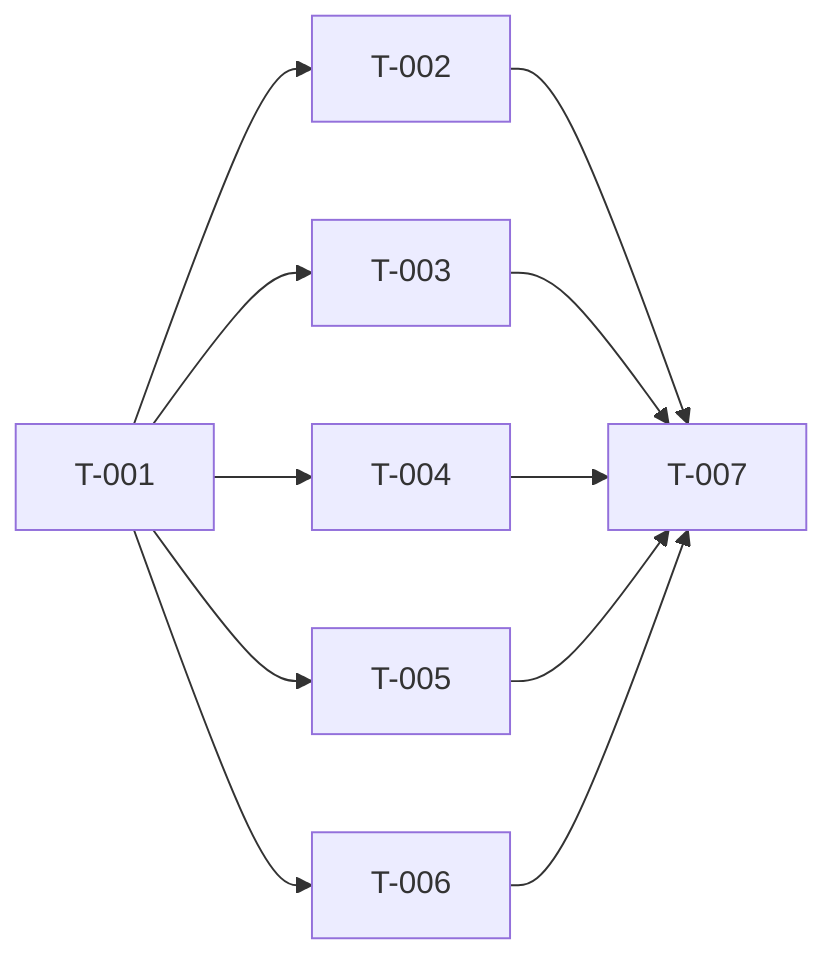

# Build Site: Venator Archetype

7 tasks across 2 tiers from 1 kit.

---

## Tier 0 — No Dependencies (Start Here)

| Task | Title | Cavekit | Requirement | Effort |
|------|-------|---------|-------------|--------|
| T-001 | Create Venator archetype entry | cavekit-venator-archetype.md | R1, R6 | S |

---

## Tier 1 — Depends on Tier 0

| Task | Title | Cavekit | Requirement | blockedBy | Effort |
|------|-------|---------|-------------|-----------|--------|
| T-002 | Create Blended Training archetype-feature | cavekit-venator-archetype.md | R2, R3, R4, R5, R6 | T-001 | S |
| T-003 | Create Trapper archetype-feature | cavekit-venator-archetype.md | R2, R3, R4, R5, R6 | T-001 | S |
| T-004 | Create Herding Rush archetype-feature | cavekit-venator-archetype.md | R2, R3, R4, R5, R6 | T-001 | S |
| T-005 | Create Harrying Traps archetype-feature | cavekit-venator-archetype.md | R2, R3, R4, R5, R6 | T-001 | S |
| T-006 | Create Tandem Harry archetype-feature | cavekit-venator-archetype.md | R2, R3, R4, R5, R6 | T-001 | S |
| T-007 | Build validation | — | — | T-002, T-003, T-004, T-005, T-006 | S |

---

## Summary

| Tier | Tasks | Effort |
|------|-------|--------|
| 0 | 1 | 1×S |
| 1 | 6 | 6×S |

**Total: 7 tasks, 2 tiers**

---

## Coverage Matrix

| Cavekit | Req | Criterion | Task(s) | Status |
|---------|-----|-----------|---------|--------|
| cavekit-venator-archetype.md | R1 | venator.md exists at correct path | T-001 | COVERED |
| cavekit-venator-archetype.md | R1 | id: venator, name: Venator, className: courser, tags: [] | T-001 | COVERED |
| cavekit-venator-archetype.md | R1 | No system/type in frontmatter | T-001 | COVERED |
| cavekit-venator-archetype.md | R1 | Body has source intro prose | T-001 | COVERED |
| cavekit-venator-archetype.md | R2 | Exactly 5 archetype-feature files | T-002–T-006 | COVERED |
| cavekit-venator-archetype.md | R2 | Set is exactly Blended Training, Trapper, Herding Rush, Harrying Traps, Tandem Harry | T-002–T-006 | COVERED |
| cavekit-venator-archetype.md | R2 | No standalone Violent Herding file | T-002–T-006 | COVERED |
| cavekit-venator-archetype.md | R3 | Each entry has id, name, archetypeId: venator, level, tags: [] | T-002–T-006 | COVERED |
| cavekit-venator-archetype.md | R3 | id = filename, lowercase kebab-case | T-002–T-006 | COVERED |
| cavekit-venator-archetype.md | R3 | No system/type in frontmatter | T-002–T-006 | COVERED |
| cavekit-venator-archetype.md | R3 | Levels correct (BT:1, Trap:1, HR:3, HT:4, TH:9) | T-002–T-006 | COVERED |
| cavekit-venator-archetype.md | R4 | Blended Training alters: skill-expertise | T-002 | COVERED |
| cavekit-venator-archetype.md | R4 | Trapper replaces: survivalist | T-003 | COVERED |
| cavekit-venator-archetype.md | R4 | Herding Rush replaces: determined-stalker, alters: opportune-stalker + tenacious-stalker | T-004 | COVERED |
| cavekit-venator-archetype.md | R4 | Harrying Traps alters: harrying-assault | T-005 | COVERED |
| cavekit-venator-archetype.md | R4 | Tandem Harry replaces: deadly-assault | T-006 | COVERED |
| cavekit-venator-archetype.md | R4 | No replaces: fleeting-blow on any entry | T-002–T-006 | COVERED |
| cavekit-venator-archetype.md | R5 | Each body has verbatim source prose | T-002–T-006 | COVERED |
| cavekit-venator-archetype.md | R5 | Herding Rush body includes At 8th level improvement | T-004 | COVERED |
| cavekit-venator-archetype.md | R5 | No Wikidot markup tokens | T-002–T-006 | COVERED |
| cavekit-venator-archetype.md | R5 | No inline Source lines | T-002–T-006 | COVERED |
| cavekit-venator-archetype.md | R5 | No inline replaces/alters prose | T-002–T-006 | COVERED |
| cavekit-venator-archetype.md | R6 | No system/type in any frontmatter | T-001–T-006 | COVERED |

**Coverage: 23/23 criteria (100%)**

---

## Dependency Graph

After T-001, T-002–T-006 run in parallel (5 independent files). T-007 validates everything.
