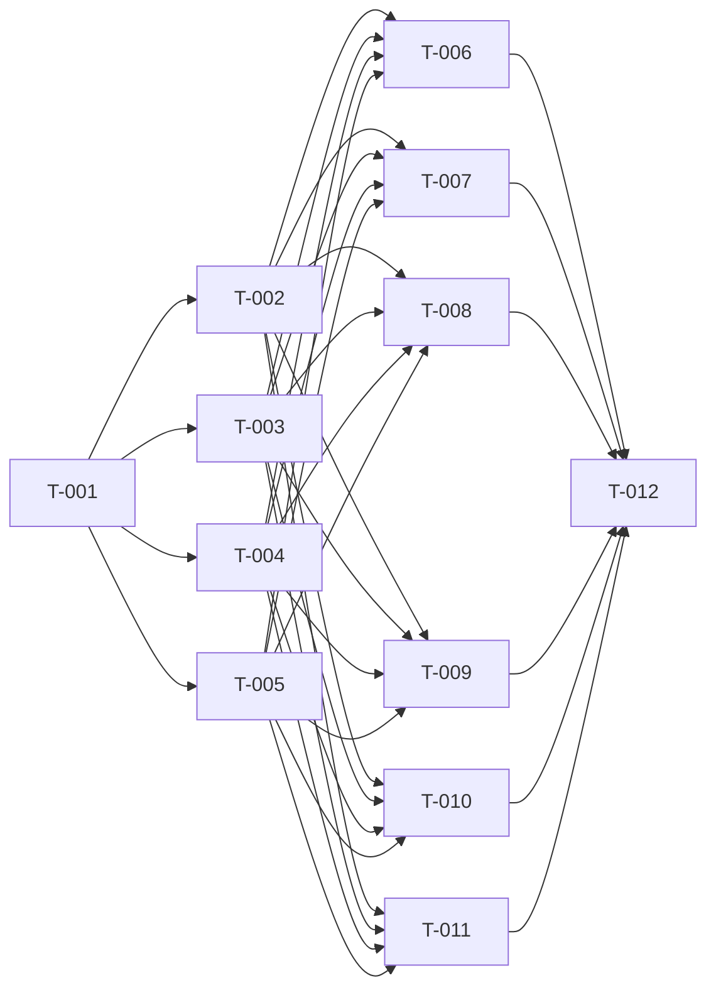

# Build Site: Courser Class Conversion

Generated: 2026-06-11

Converts the Wikidot archive page `courser.txt` into 54 spheres-wiki markdown
content files across three books (Spheres of Guile, Diamond Spheres: Hustle &
Bustle, Diamond Spheres: Invention & Ingenuity).

## Source Kits
- context/kits/cavekit-courser-class-entry.md (R1–R5, 29 acceptance criteria)
- context/kits/cavekit-courser-class-features.md (R1–R6, 13 acceptance criteria)
- context/kits/cavekit-courser-core-ventures.md (R1–R7, 22 acceptance criteria)
- context/kits/cavekit-courser-drs-content.md (R1–R7, 26 acceptance criteria)

## Source / Reference
- Source material: `/var/home/taylort3450/ComputerScience/SpheresRemaster3/spheresofpower-wikidot-archive/pages/courser.txt`
- Schema rules: `AGENTS.md` (class-family table), `SPEC.md` (V15/V16, V26, V33, V34, V42, V46, C11)

## Global Conventions (apply to every task)
- `id` = lowercase kebab-case (`^[a-z0-9-]+$`), must equal filename without extension.
- NEVER place `type:` or `system:` in frontmatter — both are inferred from path (SPEC V26, C11).
- Class-feature ids are UNPREFIXED (`harrying-assault`, not `courser-harrying-assault`). Exception: the container feature's natural name is `courser-ventures`.
- All venture class-traits use `featureId: "courser-ventures"`.
- Strip all Wikidot markup: `++`, `##color|text##`, `[[...]]`, `^^...^^`.
- No inline `*Source:*` attribution in bodies (SPEC V42).

---

## Tier 0 — No Dependencies (Start Here)

| Task | Title | Cavekit Ref | Requirement | Effort |
|------|-------|-------------|-------------|--------|
| T-001 | Create class entry `courser.md` (frontmatter + classTable JSON + body) | class-entry/R1–R5 | Schema-valid frontmatter, 20-level progression table, description body, no system/type field, id=filename at Guile classes path | L |

**T-001 detail**
- File: `src/content/spheres-of-guile/guile/classes/courser.md`
- Frontmatter: `id: courser`, `name: "Courser"`, `hitDie: 10`, `alignment: "Any"`, `startingWealth`, `skillRanks: 6`, `casterTier: "none"`, `babProgression: "full"`, `fortSaveProgression: "good"`, `refSaveProgression: "good"`, `willSaveProgression: "poor"`, `classSkills` (17 "Without a Trade Tradition" skills), `classTable` (valid JSON).
- `classTable.extraHeaders` = `["Fast Movement", "Any", "Utility"]`; 20 rows of extra-column data; `specialSource` labels for levels 8, 10, 12, 16, 19 only (NOT 20).
- Body: opening paragraph verbatim, no Wikidot tokens, no `*Source:*`.
- Test: file parses as valid frontmatter; `classTable` is valid JSON; full build deferred to T-012.

---

## Tier 1 — Depends on T-001 (Class Features)

All blockedBy: T-001. All cavekit ref: class-features/R1–R6. Files under
`src/content/spheres-of-guile/guile/class-features/`. Each frontmatter has `id`,
`name`, `className: "courser"`, `level`, `tags: []`. No `system`/`type`.

| Task | Title | Features (level) | blockedBy | Effort |
|------|-------|------------------|-----------|--------|
| T-002 | Level-1 class features | weapon-and-armor-proficiency (1), skill-expertise (1), forage (1), survivalist (1) | T-001 | M |
| T-003 | Level-2–4 class features | courser-ventures (2, `isTraitContainer: true`), fast-movement (2), determined-stalker (3), vigilant (3), harrying-assault (4) | T-001 | M |
| T-004 | Level-5–9 class features | relentless (5), stalwart (5), distant-advance (6), resourceful-foraging (7), deadly-assault (9), withstand-force (9) | T-001 | M |
| T-005 | Level-13–20 class features | opportune-stalker (13), tireless (14), unyielding (15), tenacious-stalker (17), incredible-vitality (18), master-courser (20) | T-001 | M |

- T-003 note: `courser-ventures` is the ONLY feature with `isTraitContainer: true`.
- Test: 21 feature files exist; ids unprefixed kebab-case = filename; `courser-ventures` is sole container; bodies free of Wikidot tokens and `*Source:*`.

---

## Tier 2 — Depends on T-001 + T-002 + T-003 + T-004 + T-005 (Ventures + ACF)

All blockedBy: T-001, T-002, T-003, T-004, T-005 (need class entry + all
features, especially the `courser-ventures` container and `harrying-assault` /
`deadly-assault` for the ACF `replaces`).

### Core ventures — `src/content/spheres-of-guile/guile/class-traits/courser/`
Each: `className: "courser"`, `featureId: "courser-ventures"`, `tags: []`, no `system`/`type`.

| Task | Title | Cavekit Ref | Ventures (count) | Effort |
|------|-------|-------------|------------------|--------|
| T-006 | Base-level core ventures | core-ventures/R1–R7 | combat-trick, determined-rider, enduring, harvest-meat, hunting-companion, natural-survivor, rogue-talent, simple-pleasures, terrain-expertise, woodland-acumen (10) — no level gate | L |
| T-007 | 4th-level core ventures | core-ventures/R1–R7 | ambusher, deadly-hunter, deep-wounds, friend-of-the-wilds, ironclad-stalker, stomach-punch (6) — `requires` 4th-level | M |
| T-008 | 6th-level core ventures | core-ventures/R1–R7 | natures-garnish, planar-foraging, slaughter, thaumic-disruption, vicious-strikes (5) — `requires` 6th-level | M |
| T-009 | 8th + 12th-level core ventures | core-ventures/R1–R7 | astral-tracking, slaughtering-critical, thorough-foraging (8th); improved-astral-tracking (12th) (4) | M |

- Sphere/ability `requires` (R4): harvest-meat → Survivalism (harvest) package; deadly-hunter → 4th-level + Survivalism sphere; natures-garnish → 6th-level + Herbalism sphere; improved-astral-tracking → 12th-level + Astral Tracking venture.
- Asterisk ventures (R6): stomach-punch, slaughter, thaumic-disruption add a harrying-assault option via body prose only — no asterisk frontmatter key, no trailing `*` on name.
- R5: no `(requires ...)` restated inline in body.

### Diamond Spheres content
| Task | Title | Cavekit Ref | Output | Effort |
|------|-------|-------------|--------|--------|
| T-010 | DRS ventures (Hustle & Bustle) | drs-content/R1, R3, R5, R6, R7 | 5 class-traits under `src/content/diamond-spheres-hustle-and-bustle/guile/class-traits/courser/`: head-smash (6th), perpetual-acclimation (8th), unabated-pursuit (4th), opportunistic-harry (6th), pin-down (12th) | M |
| T-011 | Cook ACF (Invention & Ingenuity) | drs-content/R2, R4, R7 | 1 archetype-feature under `src/content/diamond-spheres-invention-and-ingenuity/guile/archetype-features/courser/` | S |

- T-010 unconfirmed-source notes (R5): unabated-pursuit, opportunistic-harry, pin-down bodies each include an unconfirmed-source note. Confirmed (R6): head-smash, perpetual-acclimation carry NO note.
- T-011 ACF frontmatter (R4): `archetypeId: "courser-alternate-class-features"`, `isAlternateClassFeature: true`, `level: 1`, `replaces: ["harrying-assault", "deadly-assault"]` (unprefixed), `id` = filename. No virtual parent archetype content file (SPEC V46).

---

## Tier 3 — Depends on All Tier 2 (Validation)

| Task | Title | Cavekit Ref | Requirement | blockedBy | Effort |
|------|-------|-------------|-------------|-----------|--------|
| T-012 | Build validation | overview / SPEC V34 | After all 54 files written, run `npm run build`; confirm 0 errors. Spot-check counts: 1 class + 21 features + 26 core ventures + 5 DRS ventures + 1 ACF = 54. | T-006, T-007, T-008, T-009, T-010, T-011 | S |

---

## Dependency Graph

Parallelization notes:
- After T-001 completes, T-002 / T-003 / T-004 / T-005 can run in parallel (independent file batches).
- After all features exist, T-006 / T-007 / T-008 / T-009 / T-010 / T-011 can run in parallel (six independent file batches).
- T-012 is the single join/validation gate.

---

## Coverage Matrix

Every acceptance criterion from every requirement, mapped to the task that
satisfies it. 90 criteria total.

### cavekit-courser-class-entry.md (29 criteria)

| Req | Criterion | Task |
|-----|-----------|------|
| R1 | Frontmatter delimited by `---` at top | T-001 |
| R1 | `id` equals `courser` | T-001 |
| R1 | `name` equals `"Courser"` | T-001 |
| R1 | `hitDie` equals `10` | T-001 |
| R1 | `alignment` equals `"Any"` | T-001 |
| R1 | `startingWealth` exact string | T-001 |
| R1 | `skillRanks` equals `6` | T-001 |
| R1 | `casterTier` equals `"none"` | T-001 |
| R1 | `babProgression` equals `"full"` | T-001 |
| R1 | `fortSaveProgression` equals `"good"` | T-001 |
| R1 | `refSaveProgression` equals `"good"` | T-001 |
| R1 | `willSaveProgression` equals `"poor"` | T-001 |
| R1 | `classSkills` = 17 "Without a Trade Tradition" skills | T-001 |
| R1 | `classTable` present and valid JSON | T-001 |
| R2 | `extraHeaders` = `["Fast Movement", "Any", "Utility"]` | T-001 |
| R2 | 20 levels of extra-column row data match source | T-001 |
| R2 | Level 8 specialSource = "Venture" | T-001 |
| R2 | Level 10 specialSource (Forage improvement, Harrying assault, Venture) | T-001 |
| R2 | Level 12 specialSource = "Venture" | T-001 |
| R2 | Level 16 specialSource (Harrying assault, Venture) | T-001 |
| R2 | Level 19 specialSource (Opportune stalker, Resourceful foraging) | T-001 |
| R2 | No specialSource entry for level 20 | T-001 |
| R3 | Opening description paragraph verbatim | T-001 |
| R3 | No Wikidot markup tokens in body | T-001 |
| R3 | No inline `*Source:*` line | T-001 |
| R4 | No `system:` key | T-001 |
| R4 | No `type:` key | T-001 |
| R5 | `id` equals filename | T-001 |
| R5 | Resides at Spheres of Guile / Guile classes path | T-001 |

### cavekit-courser-class-features.md (13+ criteria)

| Req | Criterion | Task(s) |
|-----|-----------|---------|
| R1 | Exactly 21 class-feature entries exist | T-002, T-003, T-004, T-005 (verified T-012) |
| R1 | Feature set is exactly the 21 named features | T-002, T-003, T-004, T-005 |
| R1 | Each frontmatter has id, name, className=courser, level, tags=[] | T-002, T-003, T-004, T-005 |
| R2 | Each `id` equals filename | T-002, T-003, T-004, T-005 |
| R2 | Each `id` lowercase kebab-case | T-002, T-003, T-004, T-005 |
| R2 | Ids NOT class-prefixed (except natural `courser-ventures`) | T-002, T-003, T-004, T-005 |
| R2 | `featureId: "courser-ventures"` matches container id exactly | T-003 (defines container id) |
| R3 | Courser Ventures has `isTraitContainer: true` | T-003 |
| R3 | No other feature sets `isTraitContainer` | T-002, T-003, T-004, T-005 |
| R4 | Each body reproduces source section verbatim | T-002, T-003, T-004, T-005 |
| R4 | No Wikidot markup tokens in feature bodies | T-002, T-003, T-004, T-005 |
| R4 | No `*Source:*` line in feature bodies | T-002, T-003, T-004, T-005 |
| R5 | Each feature `level` matches progression table | T-002, T-003, T-004, T-005 |
| R6 | No `system:` key in feature frontmatter | T-002, T-003, T-004, T-005 |
| R6 | No `type:` key in feature frontmatter | T-002, T-003, T-004, T-005 |

### cavekit-courser-core-ventures.md (22 criteria)

| Req | Criterion | Task(s) |
|-----|-----------|---------|
| R1 | Exactly 26 core venture class-traits exist | T-006, T-007, T-008, T-009 (verified T-012) |
| R1 | Venture set is exactly the 26 named ventures | T-006, T-007, T-008, T-009 |
| R1 | The 5 DRS ventures are NOT in this set | T-006, T-007, T-008, T-009 |
| R2 | Each frontmatter: id, name, className=courser, featureId=courser-ventures, tags=[] | T-006, T-007, T-008, T-009 |
| R2 | Each `id` = filename, lowercase kebab-case | T-006, T-007, T-008, T-009 |
| R3 | 10 base-level ventures carry no level gate | T-006 |
| R3 | 6 4th-level ventures state 4th-level requirement | T-007 |
| R3 | 5 6th-level ventures state 6th-level requirement | T-008 |
| R3 | 3 8th-level ventures state 8th-level requirement | T-009 |
| R3 | improved-astral-tracking states 12th-level requirement | T-009 |
| R4 | harvest-meat requires Survivalism (harvest) package | T-006 |
| R4 | deadly-hunter requires 4th-level + Survivalism sphere | T-007 |
| R4 | natures-garnish requires 6th-level + Herbalism sphere | T-008 |
| R4 | improved-astral-tracking requires 12th-level + Astral Tracking venture | T-009 |
| R5 | Each body reproduces source prose verbatim | T-006, T-007, T-008, T-009 |
| R5 | No Wikidot markup tokens in venture bodies | T-006, T-007, T-008, T-009 |
| R5 | No `*Source:*` line in venture bodies | T-006, T-007, T-008, T-009 |
| R5 | No inline `(requires ...)` restated in body | T-006, T-007, T-008, T-009 |
| R6 | stomach-punch/slaughter/thaumic-disruption have no asterisk key | T-007, T-008 |
| R6 | Harrying-assault option conveyed by prose; no trailing `*` on name | T-007, T-008 |
| R7 | No `system:` key in venture frontmatter | T-006, T-007, T-008, T-009 |
| R7 | No `type:` key in venture frontmatter | T-006, T-007, T-008, T-009 |

### cavekit-courser-drs-content.md (26 criteria)

| Req | Criterion | Task(s) |
|-----|-----------|---------|
| R1 | Exactly 5 venture class-traits in Hustle & Bustle | T-010 (verified T-012) |
| R1 | Set = Head Smash, Perpetual Acclimation, Unabated Pursuit, Opportunistic Harry, Pin Down | T-010 |
| R1 | Each resides under H&B Guile Courser class-traits dir | T-010 |
| R2 | Exactly 1 Cook archetype-feature in Invention & Ingenuity | T-011 (verified T-012) |
| R2 | Resides under I&I Guile Courser archetype-features dir | T-011 |
| R3 | Each frontmatter: id, name, className=courser, featureId=courser-ventures, tags=[] | T-010 |
| R3 | Each `id` = filename, lowercase kebab-case | T-010 |
| R3 | unabated-pursuit requires 4th-level | T-010 |
| R3 | head-smash requires 6th-level | T-010 |
| R3 | opportunistic-harry requires 6th-level | T-010 |
| R3 | perpetual-acclimation requires 8th-level | T-010 |
| R3 | pin-down requires 12th-level | T-010 |
| R4 | `archetypeId` = `"courser-alternate-class-features"` | T-011 |
| R4 | `isAlternateClassFeature` = true | T-011 |
| R4 | `level` = 1 | T-011 |
| R4 | `replaces` = `["harrying-assault", "deadly-assault"]` (unprefixed) | T-011 |
| R4 | `id` = filename, lowercase kebab-case | T-011 |
| R5 | unabated-pursuit body has unconfirmed-source note | T-010 |
| R5 | opportunistic-harry body has unconfirmed-source note | T-010 |
| R5 | pin-down body has unconfirmed-source note | T-010 |
| R6 | head-smash body has NO unconfirmed note | T-010 |
| R6 | perpetual-acclimation body has NO unconfirmed note | T-010 |
| R7 | Each body reproduces source prose (stripped `^^Source:^^`) | T-010, T-011 |
| R7 | No Wikidot markup tokens in bodies | T-010, T-011 |
| R7 | No `*Source:*` line in bodies | T-010, T-011 |
| R7 | No `system:`/`type:` key in frontmatter | T-010, T-011 |

Coverage: 90 / 90 acceptance criteria — 100% COVERED. No gaps.

---

## Summary Table

| Tier | Tasks | Outputs | Files |
|------|-------|---------|-------|
| 0 | T-001 | Class entry | 1 |
| 1 | T-002, T-003, T-004, T-005 | Class features | 21 |
| 2 | T-006, T-007, T-008, T-009 | Core ventures | 26 |
| 2 | T-010 | DRS ventures | 5 |
| 2 | T-011 | Cook ACF | 1 |
| 3 | T-012 | Build validation | 0 (gate) |
| **Total** | **12 tasks** | | **54 files** |

Effort distribution: S × 2 (T-011, T-012), M × 8, L × 2 (T-001 classTable, T-006 batch of 10).

---

## Architect Report

- Decomposition: 25 kit requirements (90 acceptance criteria) decomposed into 12 tasks. Granularity follows the venture/feature level groupings so the four Tier-1 batches and six Tier-2 batches can be built in parallel rather than as monolithic single tasks.
- Dependency integrity: DAG with no cycles. Three tiers plus a validation gate. T-001 is the sole Tier-0 root; T-012 is the sole sink. Tier-2 tasks all depend on the full feature set (T-002–T-005) because ventures bind to the `courser-ventures` container and the Cook ACF's `replaces` references `harrying-assault` (T-003) and `deadly-assault` (T-004).
- Coverage: 90/90 criteria mapped, 100% covered, zero gaps. Count-based criteria (R1 "exactly N entries") are satisfied by the creating tasks and independently re-verified by T-012's build/count check.
- Risk / watch items:
  1. classTable JSON (T-001) is the highest-complexity artifact — 20 rows × 3 extra columns plus 5 `specialSource` labels, with the deliberate omission at level 20. Schema-validate JSON before build.
  2. Unprefixed id convention is easy to get wrong; the only legitimately "prefixed-looking" id is `courser-ventures` (natural feature name). Builders must not add `courser-` to any other feature/venture id.
  3. `replaces` values (T-011) must exactly match the unprefixed base feature ids from T-003/T-004 — a mismatch silently breaks the ACF linkage.
  4. Asterisk ventures (R6) require stripping the trailing `*` from names while preserving the harrying-assault note in prose.
  5. Unconfirmed-source notes (R5) apply to exactly three DRS ventures; head-smash and perpetual-acclimation must NOT receive one (R6).
- Recommended execution order: T-001 → (T-002 ‖ T-003 ‖ T-004 ‖ T-005) → (T-006 ‖ T-007 ‖ T-008 ‖ T-009 ‖ T-010 ‖ T-011) → T-012.
