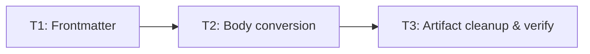

# Build Site: About Advanced Magic Conversion

Converts `spheresofpower-wikidot-archive/pages/about-advanced-magic.txt` into
`src/content/ultimate-spheres-of-power/articles/about-advanced-magic.md`.

## Source Kits

- cavekit-content-conversion.md: R1, R2, R3

## Tasks

### Tier 0 — No Dependencies (Start Here)

| Task | Tier | Description | Kit Refs | Dependencies |
|------|------|-------------|----------|--------------|
| T1 | 0 | Create the output file `src/content/ultimate-spheres-of-power/articles/about-advanced-magic.md` with a YAML frontmatter block delimited by `---`. Set `id: about-advanced-magic`, `name: "About Advanced Magic"`, `type: article`, `system: power`, `tags: []`. Match the frontmatter style of the existing `casting-traditions.md` article. | content-conversion/R1 | none |

### Tier 1 — Body Conversion (Depends on Tier 0)

| Task | Tier | Description | Kit Refs | Dependencies |
|------|------|-------------|----------|--------------|
| T2 | 1 | Convert the body prose and headings. Append after the frontmatter: the two intro/world-tone paragraphs; convert each `+ [[[Page Name]]]` line to an H2 (`## Advanced Talents`, `## Incantations`, `## Rituals`, `## Spellcrafting`, `## Wild Magic`) in source order; convert `++ ##000000\|Why so many systems?##` to `### Why so many systems?`; convert the `----` line to a markdown horizontal rule (`---`). Include all seven prose paragraphs verbatim (intro, world-tone, one per section, closing paragraph) with no omission or paraphrase. | content-conversion/R2 | T1 |

### Tier 2 — Artifact Cleanup & Verification (Depends on Tier 1)

| Task | Tier | Description | Kit Refs | Dependencies |
|------|------|-------------|----------|--------------|
| T3 | 2 | Strip all Wikidot artifacts and verify the file. Confirm no `title:`/`parent:` header lines remain in the body, no `[[include sop-template]]` directive remains, and no residual triple-bracket link syntax (`[[[`/`]]]`) or color-code syntax (`##...\|...##`) remains anywhere. Run the project schema/build check to confirm the entry validates. | content-conversion/R3 | T2 |

## Dependency Graph

## Coverage Matrix

| Kit | Req | Acceptance Criterion | Task(s) |
|-----|-----|----------------------|---------|
| content-conversion | R1 | YAML frontmatter block delimited by `---` at top | T1 |
| content-conversion | R1 | `id` equals `about-advanced-magic` | T1 |
| content-conversion | R1 | `name` equals `"About Advanced Magic"` | T1 |
| content-conversion | R1 | `type` equals `article` | T1 |
| content-conversion | R1 | `system` equals `power` | T1 |
| content-conversion | R1 | `tags` is an empty array `[]` | T1 |
| content-conversion | R2 | Each `+ [[[Page Name]]]` becomes an H2 with bracket syntax removed | T2 |
| content-conversion | R2 | Five section H2 headings in source order | T2 |
| content-conversion | R2 | `++ ##000000\|...##` becomes `### Why so many systems?` | T2 |
| content-conversion | R2 | `----` becomes markdown horizontal rule | T2 |
| content-conversion | R2 | All seven prose paragraphs present verbatim | T2 |
| content-conversion | R3 | No `title:`/`parent:` header lines in body | T3 |
| content-conversion | R3 | No `[[include sop-template]]` directive | T3 |
| content-conversion | R3 | No residual `[[[`/`]]]` or `##...\|...##` syntax | T3 |

All 14 acceptance criteria map to at least one task. No gaps.
