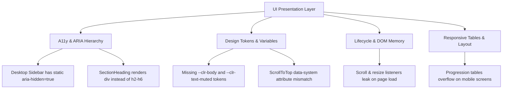
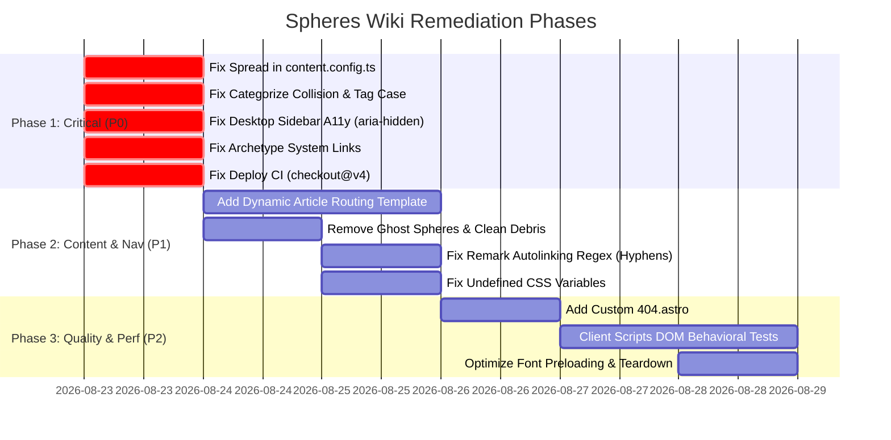

# Comprehensive Codebase Audit Report — Spheres Wiki

**Project:** `spheres-wiki` (Drop Dead Studios Spheres TRPG Static Wiki)  
**Date:** 2026-08-22  
**Audit Fleet:** 4 Specialized Antigravity Subagents  
**Scope:** Core Logic & Data Architecture, Frontend & UI/a11y, Content & Navigation Integrity, System Build & Testing Infrastructure.

---

## Executive Summary

A fleet of 4 specialized subagents conducted a multi-perspective audit of the entire `spheres-wiki` codebase (6,200+ markdown entries, TypeScript libraries, Astro layouts, build scripts, and CI workflows).

### Domain Health Scorecard
| Domain | Health Rating | Critical Issues (P0) | High/Medium Warnings (P1/P2) | Recommendations |
|---|:---:|:---:|:---:|:---:|
| **Logic & Core Data** | **B+** | 5 | 6 | 9 |
| **UI, Visual & A11y** | **B** | 3 | 7 | 9 |
| **Content & Navigation** | **B+** | 2 | 5 | 8 |
| **System, Build & Tests** | **B+** | 3 | 7 | 11 |

---

## 1. Logic & Core Data Layer Findings

### 1.1 Inverted Spread in `content.config.ts` Overwriting Frontmatter
- **Location:** [`src/content.config.ts`](file:///home/taylor/Projects/spheres-wiki/src/content.config.ts#L25-L29)
- **Root Cause:** In `spheresLoader`, `args.data` is merged as `args.data = { ...args.data, ...inferred };`. Because `inferred` is spread second, path-derived properties silently overwrite explicit frontmatter values. This directly contradicts `inferFromPath.ts` design specification ("frontmatter always wins, enabling per-file overrides") and `resolveEntries.ts` (line 224: `{ ...inferred, ...raw }`).
- **Fix:**
  ```ts
  args.data = { ...inferred, ...args.data };
  ```

### 1.2 Cross-Type ID Collision in `categorize.ts`
- **Location:** [`src/lib/categorize.ts`](file:///home/taylor/Projects/spheres-wiki/src/lib/categorize.ts#L27-L46)
- **Root Cause:** `claimMatching` tracks claimed entries using a raw `usedIds: Set<string>` of `e.id` without namespacing by entry type. If a talent and a feat share the same ID within a sphere (e.g., `berserker`, `fencing`), claiming the talent prevents the feat from matching any category or appearing in the "Other" section.
- **Fix:** Namespace entries by type:
  ```ts
  const entryKey = `${type}:${e.id}`;
  if (usedIds.has(entryKey)) continue;
  usedIds.add(entryKey);
  ```

### 1.3 Case-Sensitive Tag Matching in Sphere Category Definitions
- **Location:** [`src/lib/categorize.ts`](file:///home/taylor/Projects/spheres-wiki/src/lib/categorize.ts#L36-L37)
- **Root Cause:** `effTags` is built using lowercased tags (`entry.tags.map(t => t.toLowerCase())`). However, `def.tags` and `def.excludeTags` from YAML `categoryDefinitions` are tested directly against `effTags` without lowercasing. Any category definition using uppercase or title-case tags (e.g., `Dual-Sphere`, `Equipment`) fails to match.
- **Fix:**
  ```ts
  const tagMatch = !def.tags || def.tags.some((tag) => effTags.has(tag.toLowerCase()));
  const excludeMatch = !def.excludeTags?.some((tag) => effTags.has(tag.toLowerCase()));
  ```

### 1.4 Prerequisite Autolinking Truncating Hyphenated and Possessive Names
- **Location:** [`src/lib/remarkEntryLinks.ts`](file:///home/taylor/Projects/spheres-wiki/src/lib/remarkEntryLinks.ts#L179)
- **Root Cause:** `wordRegex` is defined as `/[A-Z][a-zA-Z]+(?:\s+[A-Z][a-zA-Z]+)*(?:\s+\d+)?/g`. Because `[a-zA-Z]+` excludes hyphens and apostrophes, names like *Two-Handed Combat*, *Cast-Crusher*, *Archmagi's Methods*, *Defender's Bonds*, *Close-Quarters Conduction*, and *Cat's Luck* (over 118+ corpus entries) are truncated at punctuation, causing name lookup and autolinking to fail.
- **Fix:**
  ```ts
  const wordRegex = /[A-Z][a-zA-Z0-9'’-]+(?:\s+[A-Z][a-zA-Z0-9'’-]+)*(?:\s+\d+)?/g;
  ```

### 1.5 Non-Deterministic Sort in `buildResolvedMaps`
- **Location:** [`src/lib/resolveEntries.ts`](file:///home/taylor/Projects/spheres-wiki/src/lib/resolveEntries.ts#L97-L100)
- **Root Cause:** `books.sort((a, b) => new Date(a.publishedDate).getTime() - new Date(b.publishedDate).getTime())` returns `0` when books share default/placeholder dates (`1970-01-01`), defaulting to non-deterministic filesystem glob order across different environments.
- **Fix:** Add deterministic secondary tie-breaker:
  ```ts
  (a, b) => (new Date(a.publishedDate).getTime() - new Date(b.publishedDate).getTime()) || a.slug.localeCompare(b.slug)
  ```

### 1.6 Casting Tradition Engine Slot Calculations & Prerequisite Validation
- **Locations:** [`src/lib/castingTraditions/builderHelpers.ts`](file:///home/taylor/Projects/spheres-wiki/src/lib/castingTraditions/builderHelpers.ts#L255-L261) & [`src/lib/castingTraditions/rules.ts`](file:///home/taylor/Projects/spheres-wiki/src/lib/castingTraditions/rules.ts#L180-L184)
- **Issues:**
  - `sphereDrawbacks` was omitted in `addMissingIdsToHypothetical`, causing active sphere drawbacks to be dropped when checking auto-fixes.
  - Negative drawback calculations produce negative boon slots (`-1`) when unclamped under `Math.floor(-1 / 2)`.
- **Fix:** Clamp `calculateAvailableBoonSlots` to $\ge 0$ and include `sphereDrawbacks` in state builders.

---

## 2. UI, Visual, CSS & Accessibility (a11y) Findings



### 2.1 Desktop Sidebar Hidden from Screen Readers (Critical A11y)
- **Location:** [`src/components/Sidebar.astro`](file:///home/taylor/Projects/spheres-wiki/src/components/Sidebar.astro#L8-L14)
- **Problem:** `<aside id="site-sidebar">` hardcodes `role="dialog" aria-modal="true" aria-hidden="true"`. On desktop viewports ($> 1024\text{px}$), CSS sets `display: block`, but `aria-hidden="true"` is **never** removed (it is only toggled by the mobile hamburger menu in `WikiPage.astro`).
- **Impact:** Desktop screen reader users cannot access the entire sidebar navigation.
- **Fix:** Remove hardcoded `role="dialog"` and `aria-hidden="true"` from static HTML; apply modal/dialog attributes only dynamically when mobile menu is opened.

### 2.2 Non-Semantic Section Headings
- **Location:** [`src/components/SectionHeading.astro`](file:///home/taylor/Projects/spheres-wiki/src/components/SectionHeading.astro)
- **Problem:** `SectionHeading` renders a `<div>` containing a `<span>` or `<a>` with `id={id}`. It does **not** render `<h2>`–`<h6>` HTML heading tags.
- **Impact:** Screen reader users navigating by headings (`H` key) and search engines cannot see document outlines on `index.astro`, `[system]/index.astro`, `archetypes/index.astro`, and `tags/index.astro`.
- **Fix:** Add a `tag?: 'h2' | 'h3' | 'h4' | 'span'` prop (defaulting to `h2`) to render valid heading tags.

### 2.3 Undefined Design Tokens (`--clr-body` and `--clr-text-muted`)
- **Locations:** [`src/components/ArchetypeSwapper.astro`](file:///home/taylor/Projects/spheres-wiki/src/components/ArchetypeSwapper.astro#L689), [`src/components/ClassProgressionTable.astro`](file:///home/taylor/Projects/spheres-wiki/src/components/ClassProgressionTable.astro#L58), [`src/components/Sidebar.astro`](file:///home/taylor/Projects/spheres-wiki/src/components/Sidebar.astro#L90)
- **Problem:** Components reference `var(--clr-body)` and `var(--clr-text-muted)`, which do not exist in `src/styles/global.css` (the defined tokens are `--clr-text` and `--clr-muted`).
- **Fix:** Replace references with `--clr-text` and `--clr-muted`.

### 2.4 Attribute Mismatch in ScrollToTop System Colors
- **Location:** [`src/components/ScrollToTop.astro`](file:///home/taylor/Projects/spheres-wiki/src/components/ScrollToTop.astro#L66-L70)
- **Problem:** Styles target `.scroll-to-top[data-system="Spheres of Power"]`, while `WikiPage.astro` sets `data-system={activeNamespace}` (`"power"`, `"might"`, `"guile"`, `"champions"`).
- **Impact:** System recoloring never matches; `ScrollToTop` always falls back to brand default.
- **Fix:** Update CSS selectors to `.scroll-to-top[data-system="power"]`, `[data-system="might"]`, etc.

### 2.5 Event Listener Leaks Across Page Navigations
- **Locations:** [`src/components/ScrollToTop.astro`](file:///home/taylor/Projects/spheres-wiki/src/components/ScrollToTop.astro) & [`src/components/StoreCarousel.astro`](file:///home/taylor/Projects/spheres-wiki/src/components/StoreCarousel.astro)
- **Problem:** Components attach new `window.addEventListener('scroll')` and `window.addEventListener('resize')` inside `astro:page-load` without removing prior listeners.
- **Fix:** Attach single module-level listeners or use `astro:before-swap` teardown handlers.

---

## 3. Content Integrity, Collections & Navigation

### 3.1 Orphaned Markdown Articles (Missing Routes)
- **Problem:** 12 article markdown files exist in `src/content/` across handbooks and tradition rules (e.g. `beast-tamers-handbook`, `ultimate-engineering`, `ultimate-spheres-of-power`) but lack dynamic or static routing templates in `src/pages/`:
  1. `adjusted-companion-base-attack-bonus.md`
  2. `beastmastery-and-taming-intelligent-creatures.md`
  3. `improved-familiars-and-familiar-archetypes.md`
  4. `multiple-animal-companions-and-alternatives.md`
  5. `vehicles-as-mounts.md`
  6. `about-advanced-magic.md`
  7. `casting-traditions/boons.md`
  8. `casting-traditions/custom-traditions.md`
  9. `casting-traditions/general-drawbacks.md`
  10. `casting-traditions/rules.md`
  11. `casting-traditions/sphere-drawbacks.md`
  12. `casting-traditions/standard-traditions.md`
- **Fix:** Add dynamic article routing template `src/pages/[system]/articles/[...slug].astro`.

### 3.2 Hardcoded "Ghost" Spheres in System Landing Pages
- **Location:** [`src/pages/[system]/index.astro`](file:///home/taylor/Projects/spheres-wiki/src/pages/[system]/index.astro#L28-L32)
- **Problem:** Hardcodes mock spheres (`bear` and `technomancy`) into the `power` system list that 404 when clicked. This violates Spec Invariant **§V.1**.
- **Fix:** Remove hardcoded stubs; rely strictly on discovered content collections.

### 3.3 Broken & Dangling Cross-Links
- **`wild-magic.md:8`**: Uses `[wild magic](@article:wild-magic)` which fails remark regex and links to non-existent article.
- **`improved-animal-companion.md:18`**: Links to non-existent `/sphere-bestiary`.
- **`lurker.md:11`**: Missing system route prefix (`/divination` $\rightarrow$ `/power/divination/`).
- **`bound-equipment-su.md:30-31`**: Contains raw Wikidot URLs (`http://spheresofpower.wikidot.com/...`).

### 3.4 Repository Cleanliness & Stray Artifacts
- Remove 14 loose Python scripts and JSON files left behind in `src/content/` (`batch1.json`, `count_missing.py`, `inject_batch.py`, etc.) and repo root (`remaining_feats*.txt`, `split_and_run.sh`).

---

## 4. System Architecture, Build & Testing Infrastructure

### 4.1 CI/CD Workflow Flaws & Tooling Health
- **Invalid Action Version in `deploy.yml` (line 19):** Uses `actions/checkout@v5` which is non-existent/invalid; should be `actions/checkout@v4`.
- **Missing Lockfile Enforcement:** `bun install` in both `deploy.yml` and `test.yml` should use `--frozen-lockfile` to prevent unexpected dependency drift.
- **CI Test Reporter Gap (`test.yml` lines 28–33):** Test upload artifact looks for `test-results/`, but Vitest runs without JUnit/JSON reporter outputting to that path.
- **Permissive FS Watcher:** `vite.server.fs.allow: [".", "../.."]` in `astro.config.mjs` allows file access outside the workspace boundary.

### 4.2 Invariant & Architecture Spec Drift
| Location | Spec Requirement | Current Implementation | Impact & Action |
| :--- | :--- | :--- | :--- |
| `src/pages/archetypes/index.astro` (lines 14–21) | **V5 / V53 / V48:** Single source of truth from `@/config/site`. | Hardcodes `SYSTEMS_WITH_ARCHETYPE_PAGES = new Set(["power"])`. | **Bug:** Suppresses archetype detail links for Might, Guile, and Champions. Use `SYSTEMS` from `@/config/site`. |
| `src/pages/preferences/index.astro` (lines 19–23) | **V5 / V53:** `SYSTEMS` in `src/config/site.ts` is sole source. | Hardcodes local `const SYSTEMS = [{ id: 'might', ... }]`. | **Drift:** Duplicate system definitions. Import `SYSTEMS` from `@/config/site`. |
| Multiple Pages | **V6:** All pages must pass `description` prop to `Base.astro`. | Omit `description` prop; falls back to site default. | **SEO:** Supply specific meta descriptions. |
| `SPEC.md` §I.pages | Route: `/[system]/[sphere]/feats/[feat]/` | Route: `/[system]/feats/[category]/[feat]/` | **Spec Drift:** Update `SPEC.md` to document category-based feat routing. |
| `src/pages/404.astro` | `SPEC.md` Task T25: Custom 404 page. | Missing `404.astro`. | **Feature Gap:** Create custom 404 template. |

### 4.3 Test Suite Completeness & Depth
- **Lib Unit Tests:** 20 test files in `tests/lib/` provide solid static helper verification.
- **Critical Coverage Gaps:**
  - `tests/e2e/` is an empty stub with no integration or smoke tests.
  - Client-side DOM scripts (`browseFilterClient.ts`, `collapseClient.ts`, `articleTocClient.ts`, `ArchetypeSwapper.astro`) have **zero behavioral tests** (no DOM or happy-dom tests).
  - Existing tests for `scrollspy` and `search` rely on string-matching source files (`expect(content).toContain(...)`) rather than testing real runtime behavior.

### 4.4 Font Preloading & Postinstall Overhaul
- **Font Preloading Overkill (`Base.astro` lines 28–32):** Preloads 5 font files simultaneously, including unused italic variants (`crimson-400i`, `crimson-600i`), competing for early bandwidth.
- **Node Modules Mutation (`scripts/patch-fontsource.mjs`):** Modifies `@fontsource` CSS inside `node_modules` during `postinstall`. Should be moved to custom `@font-face` definitions inside `global.css`.

---

## 5. Prioritized Remediation Roadmap



---
*Report generated automatically by the Antigravity Subagent Audit Fleet.*
